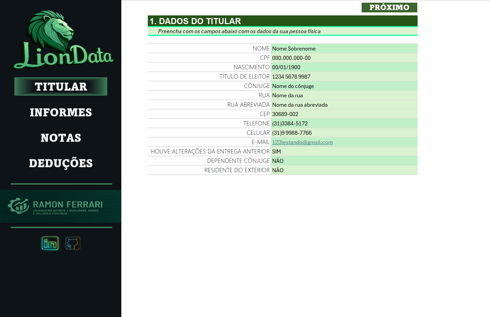
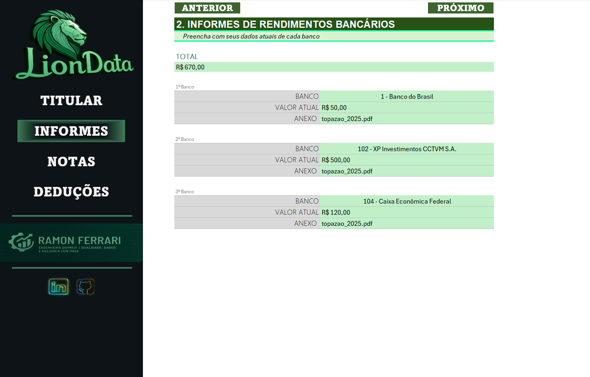
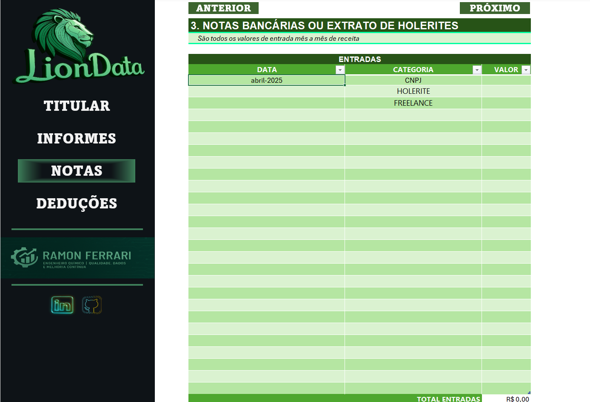
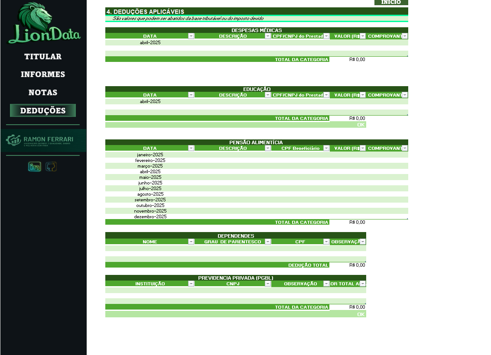

  

# 🦁 LionData – Organizador de Declaração de Imposto de Renda (2025)

> 🚀 Projeto desenvolvido como parte do **Bootcamp de Excel da DIO**, porém foi **elevado muito além da proposta inicial**, incorporando funcionalidades profissionais, automações, validações e uma interface pensada na experiência do usuário.

---

## 📄 Descrição do Projeto

O desenvolvimento partiu de um desafio proposto no Bootcamp, onde a meta era criar um organizador no Excel, **seguindo as diretrizes e aplicando os conhecimentos das aulas.**

No entanto, o projeto foi elevado, com inclusão de:

- 🔸 **Validações inteligentes de dados, além das já propostas em aula.**
- 🔸 **Aba de Deduções completa, não prevista na proposta original.**
- 🔸 **Fórmulas automáticas, alertas de limites e cálculos condicionais.**
- 🔸 **Macro aplicada nos campos de CNPJ/CPF, que ajusta automaticamente a formatação.**
- 🔸 **Interface organizada, com foco em usabilidade e design visual.**

---

## 🎯 Funcionalidades Principais

### 🔹 Aba TITULAR
- Preenchimento dos dados do contribuinte com validações.
- Verificações de:
  🔸 CPF no formato correto.
  🔸 Campos obrigatórios (nome, e-mail, telefone, etc.).
  🔸 CEP e outros dados sensíveis.
- Navegação facilitada com botão **“PRÓXIMO”**.

### 🔹 Aba INFORMES
- Organização dos informes bancários.
- Cálculo automático do total de saldos.
- Referência para anexos/documentos.

### 🔹 Aba NOTAS
- Controle dos rendimentos mensais (holerites, freelance, CNPJ, etc.).
- Categorização automática.
- Cálculo dinâmico do total informado.

### 🔥 Aba DEDUÇÕES (Desenvolvida além da proposta original)
- Controle detalhado das deduções fiscais:
  🔸 **Despesas Médicas**
  🔸 **Educação (com limite validado automaticamente)**
  🔸 **Pensão Alimentícia**
  🔸 **Previdência Privada (PGBL – com validação automática dos 12% da receita)**
  🔸 **Dependentes (com cálculo automático da dedução por dependente)**
- Resumo de deduções por categoria.
- Alertas visuais se limites forem excedidos.
- Fórmulas inteligentes para status de conformidade (OK / ⚠️ Excede Limite).
- Macros para automação e limpeza de dados.

---

## 🖼️ Capturas de Tela

### 🔹 Aba TITULAR

  

### 🔹 Aba INFORMES

  

### 🔹 Aba NOTAS

  

### 🔥 Aba DEDUÇÕES

  

---

## 🛠️ Tecnologias e Ferramentas
- ✔️ **Microsoft Excel (Avançado)**
- ✔️ Validações de Dados
- ✔️ Fórmulas Condicionais
- ✔️ Formatação Condicional
- ✔️ **Macros VBA (Automação)**
- ✔️ Git e GitHub para versionamento

---

## 🚀 Como Usar
1. Clone este repositório.
2. Abra o arquivo `LIONDATA.xlsm` no Excel.
3. Habilite macros para usar todos os recursos.
4. Preencha os dados nas abas **TITULAR → INFORMES → NOTAS → DEDUÇÕES**.

---

## 🔒 Observações Importantes
> Esta é uma ferramenta pessoal de apoio para organização das informações da declaração de imposto de renda.
> Não se trata de um gerador oficial da Receita Federal.

---

## 🤝 Créditos
**Desenvolvido por Ramon Ferrari**
Engenheiro Químico | Qualidade, Dados e Melhoria Contínua
🔗 [LinkedIn](https://www.linkedin.com)
🔗 [GitHub](https://github.com)
